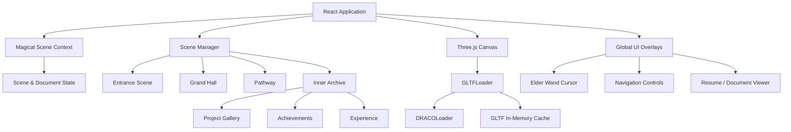
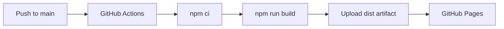

# 3D Interactive Developer Portfolio

A browser-based interactive portfolio built with **React, Vite, and native Three.js**.

The application combines real-time WebGL scenes, interactive 3D models, cinematic scene transitions, custom cursor effects, project galleries, document rendering, responsive UI, and automated GitHub Pages deployment into a single-page web experience.

---

<<<<<<< HEAD
## Overview
=======
##  Features
>>>>>>> eaa26263fb23a6def2a27ab3320d6d38a0845adc

This project is designed as an interactive 3D portfolio rather than a conventional static portfolio website.

The application is organized around a sequence of interactive scenes:

```text
Entrance
   ↓
Grand Hall
   ↓
Pathway
   ↓
Inner Archive
   ↓
Projects / Experience / Skills / Achievements
```

The 3D environment and interface are controlled through React state while Three.js handles the real-time WebGL rendering and object interactions.

---

<<<<<<< HEAD
## Key Features
=======
##  Tech Stack
>>>>>>> eaa26263fb23a6def2a27ab3320d6d38a0845adc

### 3D WebGL Environment

* Native Three.js WebGL rendering
* GLTF/GLB 3D model support
* DRACO-compressed model loading
* Dynamic lighting and shadows
* Atmospheric fog and environmental effects
* Responsive camera and viewport handling

### 3D Navigation

* `OrbitControls` for mouse-based scene rotation
* Screen-space panning
* Camera distance and angle limits
* Smooth camera interpolation
* WASD / Arrow-key navigation
* First-person style movement inside 3D environments

### Interactive 3D Objects

The application uses Three.js raycasting for object-level interaction.

Examples include:

* Interactive Magic Mirror
* Golden Snitch
* Quidditch trophy
* Elder Wand cursor
* 3D scene navigation objects

Objects can respond to pointer movement, hover states, and click interactions.

### Elder Wand Cursor

The portfolio includes a persistent 3D wand cursor rendered as a top-level overlay.

The system:

* Converts 2D mouse coordinates into 3D coordinates
* Tracks pointer movement
* Applies velocity-based rotational inertia
* Renders spark particles
* Maintains a high rendering order above the environment
* Uses `depthTest = false` to prevent the wand from disappearing behind scene geometry

### Animated 3D Flight

The Golden Snitch and Quidditch elements use procedural movement instead of fixed animation paths.

The implementation includes:

* Cubic Bézier trajectories
* Real-time orientation based on movement direction
* Wing animation using `AnimationMixer`
* Micro-jitter motion
* Particle effects

### Cinematic Scene Transitions

Scene changes are coordinated through application state and timed animation phases.

The pathway sequence includes:

1. Introductory text animation
2. Profile image reveal
3. Character-by-character name animation
4. Scene progression
5. Transition into interactive portfolio content

### Project Gallery

Projects are displayed using reusable project cards with:

* Multiple screenshots
* In-card carousel navigation
* Image indicators
* Fullscreen lightbox
* Spring-based modal animation
* Keyboard navigation

### Resume & Document Viewer

Documents are rendered directly inside the application using **PDF.js**.

The viewer supports:

* Multi-page PDFs
* Canvas-based rendering
* High-DPI rendering
* Responsive document scaling
* In-app viewing without opening a separate browser tab
* Render-task cancellation
* Certificate image galleries
* Direct document downloads

---

<<<<<<< HEAD
# Technology Stack
=======
##  Architecture
>>>>>>> eaa26263fb23a6def2a27ab3320d6d38a0845adc

| Layer         | Technology        | Purpose                                           |
| ------------- | ----------------- | ------------------------------------------------- |
| Frontend      | React 19          | Component architecture and application state      |
| Build Tool    | Vite 8            | Development server, HMR and production builds     |
| 3D Engine     | Three.js 0.185    | WebGL rendering, cameras, lighting and raycasting |
| 3D Loader     | GLTFLoader        | Loading GLTF/GLB models                           |
| Compression   | DRACOLoader       | Loading compressed 3D geometry                    |
| Animation     | Framer Motion     | UI transitions and modal animations               |
| PDF Rendering | PDF.js            | Client-side PDF rendering                         |
| Icons         | React Icons       | UI iconography                                    |
| Styling       | Vanilla CSS3      | Layout, animations, responsive design and effects |
| State         | React Context API | Global application and scene state                |
| Linting       | Oxlint            | Static JavaScript/JSX analysis                    |
| Deployment    | GitHub Actions    | Automated production deployment                   |
| Hosting       | GitHub Pages      | Static application hosting                        |

---

# Application Architecture

The application separates scene management, global state, WebGL rendering and interface overlays.



---

<<<<<<< HEAD
# Scene System
=======
##  3D Graphics & Rendering Pipeline
>>>>>>> eaa26263fb23a6def2a27ab3320d6d38a0845adc

The application uses a state-driven scene system.

### Entrance

The initial scene introduces the interactive experience and provides the transition into the main 3D environment.

### Grand Hall

The Grand Hall is a Three.js environment containing the primary interactive 3D elements.

It supports:

* Camera rotation
* Camera movement
* Interactive objects
* Lighting effects
* Navigation into the portfolio pathways

### Pathway

The pathway acts as the transition between the 3D environment and the portfolio information.

It contains the cinematic profile reveal and navigation into the archive.

### Inner Archive

The Inner Archive contains the main portfolio information:

* Projects
* Technical skills
* Experience
* Paper presentations
* Certifications
* Achievements
* Academic credentials

---

<<<<<<< HEAD
# 3D Rendering Architecture
=======
##  Document & PDF Viewer Engine
>>>>>>> eaa26263fb23a6def2a27ab3320d6d38a0845adc

The application uses **native Three.js directly** rather than React Three Fiber.

This provides direct control over:

* WebGL renderer configuration
* Render loops
* Cameras
* Lights
* Materials
* Object transforms
* Raycasting
* Animation mixers
* Particle systems
* Resource cleanup

### Rendering Configuration

The renderer uses:

* ACES Filmic tone mapping
* sRGB color space
* PCF soft shadows
* Perspective camera
* Dynamic viewport resizing
* Device-pixel-ratio limits

### Model Loading

3D assets are loaded through:

```text
GLTFLoader
    ↓
DRACOLoader
    ↓
Parsed GLTF Scene
    ↓
In-Memory Cache
    ↓
Three.js Scene
```

The in-memory cache prevents unnecessary repeated model loading when navigating between scenes.

---

<<<<<<< HEAD
# Interaction Systems
=======
##  Performance & Engineering Decisions
>>>>>>> eaa26263fb23a6def2a27ab3320d6d38a0845adc

## Raycasting

Three.js `Raycaster` is used to convert pointer coordinates into interactions with 3D objects.

This powers interactions such as:

* Hover effects
* Click detection
* Magic Mirror activation
* Quidditch object interaction

## Camera Controls

`OrbitControls` provides interactive camera rotation and navigation.

The implementation includes:

* Damping
* Screen-space panning
* Distance limits
* Polar-angle limits
* Smooth camera transitions

Keyboard navigation is also supported through WASD, Arrow keys and Q/E controls.

---

<<<<<<< HEAD
# Particle & Animation Systems
=======
##  Project Structure
>>>>>>> eaa26263fb23a6def2a27ab3320d6d38a0845adc

The application contains custom particle and animation systems rather than relying entirely on third-party animation components.

### Particle Effects

Particle buffers use pre-allocated `Float32Array` structures to manage:

* Position
* Velocity
* Lifetime
* Spark effects

Additive blending is used for magical visual effects.

### 3D Object Animation

Animated objects use Three.js animation systems and procedural transforms for:

* Wing movement
* Rotation
* Flight
* Jitter
* Banking
* Particle trails

---

# PDF & Document Rendering

The document viewer uses `pdfjs-dist` to render PDF documents directly into HTML canvas elements.

```text
PDF
 ↓
PDF.js
 ↓
PDF Document
 ↓
Individual Pages
 ↓
Canvas Rendering
 ↓
Responsive Viewer
```

The viewer includes render-task cancellation so unfinished PDF rendering operations can be stopped when the viewer is closed or the document changes.

High-DPI rendering uses the browser's `devicePixelRatio` while applying limits to prevent excessive GPU memory usage.

---

# Asset Management

Static assets are stored inside the `public/` directory.

```text
public/
├── assets/
│   ├── images/
│   └── models/
├── Achivements/
├── projects/
├── profile.jpg
└── resume.pdf
```

A centralized asset URL utility resolves static paths using Vite's:

```js
import.meta.env.BASE_URL
```

This allows the same asset references to work in both:

```text
Local development
/
```

and:

```text
GitHub Pages
/portfolio/
```

This is important because GitHub Pages hosts the project under a repository subpath rather than the domain root.

---

# Performance Engineering

The application includes several performance optimizations.

### Hardware-Aware Rendering

The application checks available browser and hardware information to adjust rendering quality.

Lower-performance devices can use:

* Reduced particle counts
* Lower device-pixel-ratio limits
* Disabled expensive shadow rendering
* Reduced antialiasing cost

### Model Caching

Previously loaded GLTF data is retained in memory to reduce repeated network requests and decoding work.

### Render Optimization

Rendering quality is adapted based on device capabilities while maintaining the core interactive experience.

### Pointer Event Isolation

3D overlay elements use pointer-event isolation so that the WebGL layer does not block normal HTML interactions such as buttons, carousels and controls.

---

# Project Structure

```text
portfolio/
│
├── .github/
│   └── workflows/
│       └── deploy.yml
│
├── public/
│   ├── .nojekyll
│   ├── resume.pdf
│   ├── assets/
│   │   ├── images/
│   │   └── models/
│   ├── Achivements/
│   └── projects/
│
├── src/
│   ├── components/
│   │   ├── canvas/
│   │   ├── scenes/
│   │   └── ui/
│   │
│   ├── context/
│   ├── data/
│   ├── hooks/
│   └── utils/
│
├── index.html
├── package.json
├── vite.config.js
└── README.md
```

---

<<<<<<< HEAD
# Getting Started
=======
##  Getting Started
>>>>>>> eaa26263fb23a6def2a27ab3320d6d38a0845adc

## Requirements

* Node.js 20+
* npm 10+

## Installation

Clone the repository:

```bash
git clone https://github.com/Abhi-wizard/portfolio.git
cd portfolio
```

Install dependencies:

```bash
npm install
```

Start the development server:

```bash
npm run dev
```

The application will be available at:

```text
http://localhost:5173
```

---

<<<<<<< HEAD
# Available Scripts
=======
## CI/CD & Deployment
>>>>>>> eaa26263fb23a6def2a27ab3320d6d38a0845adc

### Development

```bash
npm run dev
```

Starts the Vite development server with hot module replacement.

### Production Build

```bash
npm run build
```

Creates the optimized production bundle in `dist/`.

### Production Preview

```bash
npm run preview
```

Serves the production build locally for testing.

### Lint

```bash
npm run lint
```

Runs Oxlint against the project source.

---

# Deployment

The application is automatically deployed to GitHub Pages through GitHub Actions.



The deployment workflow:

1. Checks out the repository
2. Installs Node.js dependencies
3. Runs the production build
4. Uploads the `dist/` directory as a Pages artifact
5. Deploys the artifact to GitHub Pages

### Live Application

**[https://abhi-wizard.github.io/portfolio/](https://abhi-wizard.github.io/portfolio/)**

### Repository

**[https://github.com/Abhi-wizard/portfolio](https://github.com/Abhi-wizard/portfolio)**

---

<<<<<<< HEAD
# Important Deployment Configuration
=======
## License
>>>>>>> eaa26263fb23a6def2a27ab3320d6d38a0845adc

Because the application is deployed as a GitHub Pages project site, Vite uses:

```js
export default defineConfig({
  plugins: [react()],
  base: '/portfolio/',
})
```

Static assets are resolved through `import.meta.env.BASE_URL` to ensure paths work correctly after deployment.

---

# Engineering Decisions

### Native Three.js

Native Three.js was selected instead of a higher-level React 3D abstraction to maintain direct control over the WebGL rendering pipeline and interactive 3D systems.

### Centralized Asset Resolution

A shared asset resolver prevents hard-coded root-relative paths from breaking when the application is deployed under `/portfolio/`.

### In-Memory GLTF Cache

Caching avoids repeated model downloads and decoding when scenes are revisited.

### Client-Side PDF Rendering

PDF.js allows documents to be displayed inside the application without relying on a separate browser tab or external PDF viewer.

### Responsive Rendering

The application dynamically adapts rendering quality based on device capabilities to maintain usability across desktop and lower-powered devices.

---

# Technical Considerations

The portfolio contains several relatively large 3D assets. Model size and WebGL performance can therefore affect initial loading time and device performance.

Current large assets include:

* Nimbus 2000 — approximately 74 MB
* Enchanted Grimoire — approximately 30 MB
* Gothic Wall Torch — approximately 23 MB
* Elder Wand — approximately 21 MB

Future optimization opportunities include:

* Additional GLB compression
* Texture optimization
* Progressive asset loading
* Lazy-loading scene-specific models
* Further mobile GPU optimization
* CDN-based asset delivery

---

# License & Assets

The application source code and third-party 3D assets may have different licensing requirements.

Before redistributing or commercially using individual 3D models, textures, fonts, or other third-party assets, their respective licenses and usage permissions should be verified.

---

## Built With

**React · Vite · Three.js · GLTFLoader · DRACOLoader · Framer Motion · PDF.js · Vanilla CSS · GitHub Actions · GitHub Pages**