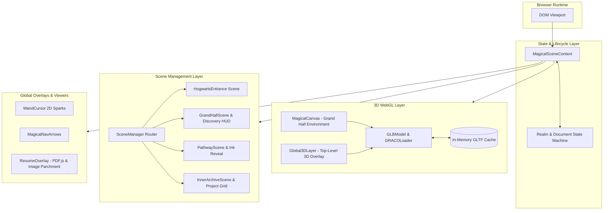
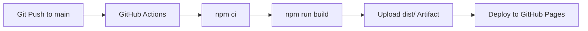

# 3D Interactive WebGL Portfolio Web Application

An interactive 3D portfolio web application built with **React 19**, **Vite**, and native **Three.js**. The application integrates real-time WebGL environments, 3D model loaders with Google DRACO compression, raycasting collision detection, autonomous physics trajectories, custom particle emitters, and client-side PDF.js canvas rendering into a unified browser-based single-page application.

---

## ✨ Features

* **Native Three.js WebGL Environment:** Full-fidelity 3D rendering using Three.js with ACES Filmic tone mapping, SRGB color space correction, exponential fog, and PCF soft shadow maps.
* **GLTF / GLB 3D Pipeline:** Asynchronous loading of `.glb` models with Google DRACO mesh compression and in-memory caching to eliminate redundant network fetches.
* **Camera Systems & Controls:** Configurable `OrbitControls` with damping, screen-space panning, distance clamping, and a cubic ease-in-out camera pose interpolation engine.
* **First-Person WASD Walk Navigation:** Real-time keyboard event listeners calculating horizontal movement vectors relative to camera orientation for exploring 3D spaces.
* **Raycasting & Collision Interactivity:** Three.js `Raycaster` integration handling hover states and click detections on 3D objects (e.g., Magic Mirror portal, Quidditch trophy).
* **Persistent 3D Wand Cursor Layer:** Real-time 3D cursor that unprojects 2D pointer coordinates into 3D camera space, calculates velocity-based inertia tilts, and emits spark particle trails.
* **Autonomous 3D Flight Physics:** Autonomous Golden Snitch and Quidditch trophy flight paths powered by cubic Bézier spline interpolation, wing flutter animation mixers, and micro-jitter displacements.
* **Cinematic Phased Scene Transitions:** Multi-stage narrative state machine coordinating timed CSS animations, progressive text ink-writing effects, and radial curtain overlays.
* **In-Card Project Carousels & Fullscreen Lightbox:** Dynamic project showcase with multi-screenshot navigation, slide indicator badges, and Spring-animated modal zoom.
* **Client-Side PDF & Document Viewer:** Multi-page PDF canvas rasterization using `pdfjs-dist` and web workers, featuring high-DPI scaling, render task cancellation, multi-certificate image galleries, and direct downloads.
* **Hardware & GPU Tier Adaptation:** Dynamic detection of mobile devices and integrated GPUs to throttle shadow maps, clamp device pixel ratios, and adjust particle counts.
* **Automated CI/CD Pipeline:** Fully automated build and deployment to GitHub Pages via GitHub Actions with `.nojekyll` bypass.

---

## 🧰 Tech Stack

| Layer / Subsystem | Technology | Version | Purpose |
| :--- | :--- | :--- | :--- |
| **Frontend Framework** | React | `19.2.8` | Component architecture, lifecycle management, and UI state |
| **Build & Dev Tooling** | Vite | `8.2.0` | Development server, HMR, bundling, and asset pipelines |
| **3D Graphics Engine** | Three.js | `0.185.1` | WebGL canvas rendering, camera control, lighting, and raycasting |
| **3D Compression** | DRACOLoader | `1.5.7` | Decompressing packed GLTF/GLB geometric meshes |
| **Animation Engine** | Framer Motion | `13.1.0` | UI transitions, spring-physics modals, and overlay lifecycle |
| **PDF Rendering** | PDF.js (`pdfjs-dist`) | `6.3.289` | Parsing and rendering multi-page PDF documents to HTML5 canvas |
| **UI Iconography** | React Icons (`react-icons/fa`) | `5.7.0` | Vector interface iconography |
| **Styling & Design System** | Vanilla CSS3 | Standard | Custom properties, 3D transforms, glassmorphism, responsive grid |
| **State Management** | React Context API | Standard | Global realm routing, document viewer state, and spell dispatch |
| **Static Code Analysis** | Oxlint | `1.75.0` | High-performance JavaScript/JSX linting |

---

## 🏗️ Architecture

The application is structured into decoupled UI, 3D Canvas, and State Management layers:



---

## 🎮 3D Graphics & Rendering Pipeline

The 3D implementation directly interfaces with Three.js WebGL rendering contexts through React `useRef` mounts:

### 1. Scene Composition & Lighting
* **Hogwarts Grand Hall:** Rendered in [`MagicalCanvas.jsx`](file:///d:/portfolio/src/components/canvas/MagicalCanvas.jsx) with ambient lighting (`0xffecd2`), dynamic flickering PointLights simulating floating candles ($\sin(t \cdot 5.5)$ noise), and directional stained-glass window illumination (`0x70a0d0`).
* **Environment Models:** Geometry parsed via `GLTFLoader` with materials configured for `DoubleSide` depth writing and PBR roughness/metalness parameters.

### 2. Interaction & Collision Mechanics
* **3D Magic Mirror Raycasting:** The Magic Mirror model ([`MagicMirror.jsx`](file:///d:/portfolio/src/components/canvas/MagicMirror.jsx)) contains an interactive container. Pointer events map normalized device coordinates to a `THREE.Raycaster`. Hovering interpolates point light glow intensity, while click interactions initiate a 350ms flash transition into the next realm.
* **Persistent 3D Wand Cursor:** Implemented in [`WandCursor3D.js`](file:///d:/portfolio/src/components/canvas/WandCursor3D.js) with `renderOrder = 99999` and `depthTest = false`. Pointer coordinates are unprojected into a 3D plane $2.8$ units in front of the camera, applying dynamic rotational inertia ($\text{tiltX}$, $\text{tiltY}$, $\text{tiltZ}$) derived from mouse velocity vectors.

### 3. Trajectory Generation & Particle Systems
* **Bézier Flight Physics:** [`GoldenSnitchFlyer.js`](file:///d:/portfolio/src/components/canvas/GoldenSnitchFlyer.js) and [`QuidditchFlyer.js`](file:///d:/portfolio/src/components/canvas/QuidditchFlyer.js) calculate cubic Bézier curves across the scene:
  $$\mathbf{B}(t) = (1-t)^2 \mathbf{P}_0 + 2(1-t)t \mathbf{P}_1 + t^2 \mathbf{P}_2$$
  Models evaluate forward look-ahead tangents $\mathbf{T} = \mathbf{B}(t + \Delta t) - \mathbf{B}(t)$ to orient flight roll and bank angles in real-time.
* **Custom Spark Emitters:** Pre-allocated Float32 buffer arrays manage positions, velocities, and particle lifespans with additive blending (`THREE.AdditiveBlending`).

---

## 📜 Document & PDF Viewer Engine

The application includes a client-side document rasterization engine in [`ResumeOverlay.jsx`](file:///d:/portfolio/src/components/ui/ResumeOverlay.jsx):

```
PDF Document URL ──► pdfjsLib.getDocument() ──► PDFDocumentProxy
                                                        │
                      ┌─────────────────────────────────┴─────────────────────────────────┐
                      ▼                                                                   ▼
             Page 1 (Viewport Scale)                                             Page N (Viewport Scale)
                      │                                                                   │
             Canvas Context 2D                                                   Canvas Context 2D
                      │ (window.devicePixelRatio)                                         │ (window.devicePixelRatio)
                      ▼                                                                   ▼
             HTML5 <canvas> Frame 1                                              HTML5 <canvas> Frame N
```

* **High-DPI Canvas Rendering:** Calculates container widths up to $860\text{px}$, computes viewport scale ratios, scales 2D canvas drawing contexts by `window.devicePixelRatio`, and paints vector-crisp PDF pages.
* **Task Cancellation Safety:** Tracks active PDF rendering promises via a mutable `renderTasksRef`. If the user navigates away or switches documents mid-render, incomplete canvas tasks are cancelled immediately to prevent memory leaks and worker exceptions.
* **Multi-Format Support:** Automatically switches between single-page PDFs, multi-page PDFs, and multi-image certificate collections with thumbnail strip selectors and individual download links.

---

## ⚡ Performance & Engineering Decisions

1. **Imperative Three.js Integration:** Built directly on native Three.js rather than abstraction layers, providing direct control over animation frame loops, WebGL draw calls, shader textures, and memory cleanup.
2. **In-Memory Model Caching:** [`GLBModel.js`](file:///d:/portfolio/src/components/canvas/GLBModel.js) implements an in-memory `Map` cache for loaded GLTF data structures, preventing redundant network requests and CPU decoding spikes when re-entering scenes.
3. **Hardware-Aware Throttling:** [`useWebGLSupport.js`](file:///d:/portfolio/src/hooks/useWebGLSupport.js) inspects `WEBGL_debug_renderer_info` and hardware concurrency. Low-tier GPUs automatically disable shadow maps, drop antialiasing, clamp device pixel ratios to $1.0$, and reduce particle counts from $650$ to $250$.
4. **Pointer-Events Isolation:** Canvas overlays utilize `pointer-events: none` with selective raycasting listeners, ensuring full pass-through for underlying DOM UI buttons, inputs, and carousels.
5. **Base-Aware URL Resolver:** [`assetUrl.js`](file:///d:/portfolio/src/utils/assetUrl.js) provides idempotent resolution against `import.meta.env.BASE_URL`, preventing double-prefixing issues between root-level local development (`/`) and subdirectory GitHub Pages deployments (`/portfolio/`).

---

## 📂 Project Structure

```
portfolio/
├── .github/
│   └── workflows/
│       └── deploy.yml              # GitHub Actions CI/CD workflow
├── public/
│   ├── .nojekyll                   # Bypasses Jekyll on GitHub Pages
│   ├── resume.pdf                  # Master resume document
│   ├── assets/
│   │   ├── images/                 # Atmospheric background webp textures
│   │   └── models/                 # GLB 3D binary assets (DRACO-compressed)
│   ├── Achivements/                # Verification certificates & publications
│   └── projects/                   # Project screenshots by category
├── src/
│   ├── components/
│   │   ├── canvas/                 # Three.js canvases, loaders, flyers, wand cursors
│   │   ├── scenes/                 # Narrative scene managers (Entrance, Hall, Pathway, Archive)
│   │   └── ui/                     # UI components, modals, HUD overlays, document viewers
│   ├── context/                    # React Context providers and stage definitions
│   ├── data/                       # Portfolio content schemas and model catalogs
│   ├── hooks/                      # Custom hooks (parallax, scroll stage, WebGL support)
│   └── utils/                      # Base-aware asset URL resolution utilities
├── index.html                      # HTML entry template
├── package.json                    # Project dependencies and script definitions
└── vite.config.js                  # Vite configuration with base path and nojekyll plugin
```

---

## 🚀 Getting Started

### Prerequisites
* **Node.js:** `v20.x` or higher
* **npm:** `v10.x` or higher

### Installation & Setup

1. **Clone the repository:**
   ```bash
   git clone https://github.com/Abhi-wizard/portfolio.git
   cd portfolio
   ```

2. **Install dependencies:**
   ```bash
   npm install
   ```

3. **Start the local development server:**
   ```bash
   npm run dev
   ```
   Open `http://localhost:5173` in your browser.

4. **Execute static code analysis:**
   ```bash
   npm run lint
   ```

5. **Build for production:**
   ```bash
   npm run build
   ```

6. **Preview production bundle locally:**
   ```bash
   npm run preview
   ```

---

## 🚢 CI/CD & Deployment

The application is deployed to **GitHub Pages** via a dedicated GitHub Actions workflow ([`.github/workflows/deploy.yml`](file:///d:/portfolio/.github/workflows/deploy.yml)):



* **Deployment URL:** `https://abhi-wizard.github.io/portfolio/`
* **Workflow Configuration:** Runs on `ubuntu-latest` with Node.js 20, uses `actions/configure-pages@v5`, and deploys build artifacts with concurrency locks enabled (`group: pages`, `cancel-in-progress: true`).

---

## 📄 License

This project is open-source and available under the standard repository terms.
